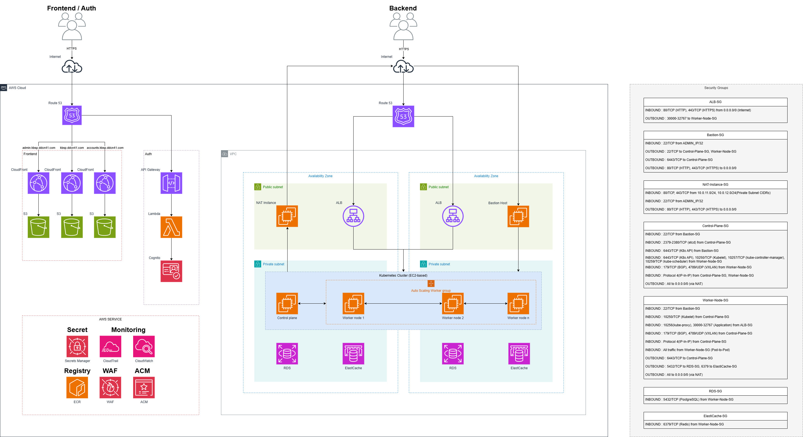

# 공연 티켓팅 서비스 및 운영 효율화를 위한 백오피스 시스템

> 공연 티켓팅 서비스 및 운영 효율화를 위한 백오피스 시스템을 3단계로 개발/보안/자동화한 클라우드 네이티브 프로젝트

## 프로젝트 개요

- 팀 구성: 4인 -> 3차에서는 Self-managed K8s 2인(팀A, 본인 포함) vs EKS 2인(팀B) 비교 구조로 진행
- 기간: 2025.08 ~ 2025.11 (3개월)

## 프로젝트 성과

- 부트캠프 우수 프로젝트 선정
- 부트캠프 우수 수료생 선정 (총 11명 중 1인)

## 전체 인프라 아키텍처

## 전체 기술 스택

| 분류 | 기술 |
|------|------|
| Frontend | React, TypeScript |
| Backend | Spring Boot, OpenFeign, 멀티모듈 |
| Database | PostgreSQL, Redis |
| IaC | Terraform, Ansible, Kubespray |
| Kubernetes | Kubernetes, Calico CNI, ArgoCD |
| AWS | VPC, EC2, RDS, ElastiCache, S3, CloudFront, Lambda, API Gateway, IAM, Secrets Manager |
| CI/CD | GitHub Actions |
| Security | Falco, Network Policy, SonarQube, OWASP Dependency Check |
| Backup | Velero |

## 레포지토리 구성

| 레포              | 설명                      | 링크                                                   |
| --------------- | ----------------------- | ---------------------------------------------------- |
| ddcn41-frontend | React 기반 관리자/사용자 UI     | [→](https://github.com/Hwara/ddcn41-frontend-v3.git) |
| ddcn41-backend  | Spring Boot REST API    | [→](https://github.com/Hwara/ddcn41-backend-v3.git)  |
| ddcn41-Infra    | Terraform, K8s, Ansible | [→](https://github.com/Hwara/ddcn41-infra-v3.git)    |

## 프로젝트 구성 (3단계)

### 1차: 서비스 개발 (2025.08~09)

#### 목표

공연 티켓팅 서비스 및 운영 효율화를 위한 백오피스 시스템 개발 및 최소한의 AWS 클라우드 환경 구축, CI/CD 파이프라인 구축

#### 담당 역할

1. Frontend 개발
    - 관리자 대시보드 UI 구현
    - 공연 및 사용자 관리 페이지 기능 구현 (등록, 수정, 삭제)

2. Backend API 개발
    - 공연 관리 API (공연 정보 CRUD)
    - 사용자 관리 API (사용자 계정 CRUD)
    - 백오피스 감사 로그 (관리자 행위 추적 및 기록)
    - AWS S3 연동 : Pre-signed URL을 활용한 공연 사진 업로드 구현

3. CI/CD 구축
    - Github Actions 기반 프론트엔드 자동 빌드
    - S3 자동 배포 파이프라인 구축
    - 코드 푸시 -> 빌드 -> 배포 자동화

4. Cloud 인프라 관리
    - AWS S3 정적 웹사이트 호스팅 설정
    - CI/CD 파이프라인과 연계된 AWS 리소스 관리
    - 프론트엔드 배포 환경 구성 (S3, CloudFront)

#### 성과

- 공연 및 사용자 관리 기능 구현을 통한 공연 티켓팅 서비스 기반 마련
- Pre-signed URL 기반 S3 업로드 구현으로 서버 리소스 소비 없이 파일 업로드 처리
- CI/CD 자동화로 프론트엔드 배포 자동화 달성

### 2차: 취약점 개선 및 MSA 전환 (2025.09~10)

#### 목표

보안 취약점 개선, MSA 전환, 서버리스 아키텍처 적용

#### 담당 역할

1. MSA 전환 (Admin 서비스 분리)
    - 기존 구조 : 하나의 모놀리식 애플리케이션
    - 변경 구조 : Core 서비스, Admin 서비스, 대기열 서비스 3개로 분리
    - 본인 역할 : Admin 서비스 분리 담당
        - OpenFeign을 활용한 서비스 간 통신 구현
        - 멀티모듈 구조 적용으로 공통 코드 재사용성 확보
        - 서비스 경계 설정 및 API 인터페이스 정의

2. 테스트 코드 작성
    - Admin 서비스에 대한 단위 테스트 작성
    - 테스트 커버리지 증대 (SonarQube로 확인)

3. 보안 취약점 스캔 및 개선
    - OWASP Dependency Check : 의존성 라이브러리 취약점 스캔
    - SonarQube : 정적 코드 분석으로 코드 품질 및 보안 취약점 탐지
    - 탐지된 취약점에 대한 코드 보완 작업 수행

4. 서버리스 아키텍처 적용
    - AWS Lambda : Admin 서비스 서버리스 전환
    - API Gateway : RESTful API 엔드포인트 구성
    - 목표 : 운영 비용 절감 및 자동 스케일링

#### 성과

- Admin 서비스 Lambda 전환으로 사용량 기반 과금 구조 확보
  (EC2 24시간 운영 비용 대비 절감)
- MSA 분리로 Admin/Core 서비스 독립 배포 가능한 구조 확보
- SonarQube 정적 분석으로 Blocker/High 등급 취약점 탐지 및 보완
- 테스트 코드 작성으로 테스트 커버리지 증대

### 3차: 인프라 자동화 (2025.10~11)

#### 목표

클라우드 인프라 자동화 및 최적 운영 아키텍처 도출

#### 담당 역할

> 팀원 건강 문제로 Kubespray 팀 내 인프라 전반을 담당

1. Terraform 기반 IaC 인프라 구축
    - AWS 리소스 코드화 :
        - VPC (Public/Private Subnet, NAT Instance)
        - Security Groups
        - EC2
        - IAM (Role, Policy, Instance Profile)
        - RDS (PostgreSQL)
        - ElastiCache (Redis)
        - Secrets Manager (DB, Cache 및 API 자격증명 관리)
    - 모듈 구조 설계
        - 재사용 가능한 모듈 구조로 설계
        - S3 Backend로 팀 협업 및 State 파일 관리
        - 변수화로 환경별 배포 유연성 확보

2. Kubespray 기반 K8s 클러스터 구축
    - 클러스터 구성
        - Master 1개, Worker 노드 2개
        - Calico CNI 설치 및 네트워크 구성
    - AWS 통합
        - AWS Load Balancer Controller : K8s Service를 AWS ALB/NLB로 자동 연결
        - External DNS : K8s Ingress를 Route 53에 자동 등록
        - External Secrets Operator : AWS Secrets Manager를 K8s Secret으로 동기화
        - Kubelet Credential Provider : ECR 이미지 Pull 인증 자동화

3. 보안 강화 시스템 구축
    - Falco 런타임 보안 모니터링
        - 컨테이너 내부 비정상 행위 실시간 탐지
        - 예 : 컨테이너 내 쉘 실행, 의심스러운 파일 변경 등
    - Network Policy:
        - Pod 간 트래픽 제어로 Zero Trust 원칙 구현
        - 서비스 간 통신 경로 제한

4. 백업 및 복구 시스템 구축
    - Velero 활용
        - K8s 리소스 및 PV 백업
        - 매일 자동 백업 스케줄 설정
        - S3에 백업 데이터 저장

5. Frontend CI/CD 구축
    - GitHub Actions + OIDC
        - pnpm Monorepo 기반 Frontend 빌드
        - S3에 정적 파일 자동 배포
        - CloudFront 캐시 무효화 자동화
    - 보안 : AWS Access Key 없이 OIDC 기반 인증으로 보안성 향상

#### 성과

- AWS 인프라 Terraform IaC 코드화로 동일 환경 재현 가능한 구조 확보
- Terraform 1.10 Lockfile 도입으로 DynamoDB 없이 State Lock 구현 (운영 비용 절감)
- NAT Instance Flag 파일 기반 의존성 관리로 Private EC2 초기화 실패 문제 해결
- Falco DaemonSet 구축으로 컨테이너 런타임 비정상 행위 실시간 탐지
- Network Policy Zero Trust 적용으로 Pod 침해 사고 발생 시 내부 공격 차단
- Velero 자동 백업으로 재해 복구 시간 단축 (velero restore 단일 명령으로 전체 K8s 리소스 복구)
- GitHub OIDC 인증 적용으로 AWS Access Key 완전 제거
- Self-managed K8s 5개 핵심 이슈 직접 해결 (Terraform 의존성 관리, Calico CNI, AWS LB Controller, ECR 인증)

## 주요 트러블슈팅

| 이슈                              | 원인                          | 해결                          | 상세                                                                                                                                   |
| ------------------------------- | --------------------------- | --------------------------- | ------------------------------------------------------------------------------------------------------------------------------------ |
| Terraform depends_on NAT 준비 미보장 | 생성 완료 ≠ 기능 활성화              | Flag 파일 + remote-exec       | [→](https://github.com/Hwara/ddcn41-infra-v3/tree/5000c654737e0bdf02bffe1e184e57d16286c6cb#1-terraform-%EC%9D%98%EC%A1%B4%EC%84%B1-%EA%B4%80%EB%A6%AC-%EB%AC%B8%EC%A0%9C)           |
| Calico CNI 적용 시 Pod 간 통신 불가     | BGP/VXLAN 포트 차단             | TCP 179, UDP 4789 허용        | [→](https://github.com/Hwara/ddcn41-infra-v3/tree/5000c654737e0bdf02bffe1e184e57d16286c6cb#2-calico-cni-%EB%84%A4%ED%8A%B8%EC%9B%8C%ED%81%AC-%ED%86%B5%EC%8B%A0-%EC%9E%A5%EC%95%A0) |
| AWS LB Controller 라우팅 실패        | 태그 누락 및 providerID 수동 설정 필요 | 태그 및 providerID 설정          | [→](https://github.com/Hwara/ddcn41-infra-v3/tree/5000c654737e0bdf02bffe1e184e57d16286c6cb#3-aws-load-balancer-controller-target-%EB%93%B1%EB%A1%9D-%EC%8B%A4%ED%8C%A8)             |
| ECR Private 이미지 Pull 401 오류     | ECR 토큰 만료                   | Kubelet Credential Provider | [→](https://github.com/Hwara/ddcn41-infra-v3/tree/5000c654737e0bdf02bffe1e184e57d16286c6cb#5-ecr-private-%EC%9D%B4%EB%AF%B8%EC%A7%80-pull-%EC%8B%A4%ED%8C%A8-401-unauthorized)      |

## 프로젝트 리뷰

3단계에 걸쳐 서비스 개발 -> 보안 강화 -> 인프라 자동화로 구조적으로 발전하는 과정을 직접 설계하고 경험했습니다.

가장 큰 배움은 공식 문서를 읽고 로그를 분석하며 문제의 근본 원인을 찾는 과정이었습니다. 표면적 오류(DNS 에러) 너머의 실제 원인 (CNI 포트 차단)을 추적하며 체계적인 트러블슈팅 루틴을 습득했습니다.

기술 선택에 있어서는 상황에 맞는 도구가 중요하다는 것을 깨달았습니다. Self-managed K8s vs EKS 비교를 통해 비용, 운영 복잡도 간의 트레이드오프를 직접 검증했습니다.

협업에 있어서는 원활한 의사소통과 유연한 태도가 중요했습니다. 팀원들과 의견을 조율하고, 제한된 시간 안에서 우선순위를 정해 집중하는 능력이 필요했습니다.

프론트엔드부터 백엔드, 인프라, 보안, CI/CD까지 애플리케이션 개발과 운영의 전 과정을 경험한 이번 프로젝트는 실무에서 유연하게 대응할 수 있는 기반이 될 것이라 생각합니다.
