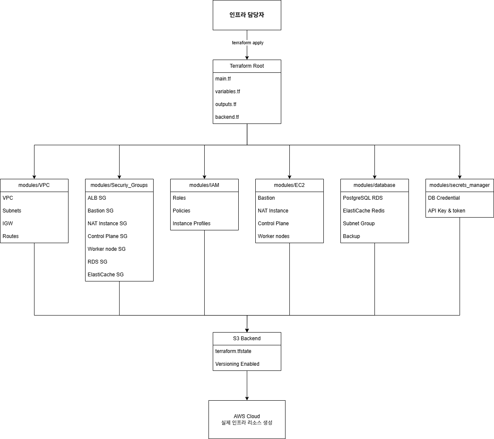

## 아키텍처 및 핵심 기능 (진영)

### 전체 시스템 아키텍처


주요 구성 요소:

네트워크 계층

- VPC 기반 Public/Private Subnet 분리로 보안 강화
- Public Subnet: Bastion Host, NAT Instance, Application Load Balancer
- Private Subnet: Kubernetes 클러스터, RDS PostgreSQL, ElastiCache Redis

컴퓨팅 계층

- Self-managed Kubernetes 클러스터 (Master 1개, Worker 2개)
- Kubespray를 통한 자동 배포
- Calico CNI로 네트워크 및 보안 정책 관리
- containerd 런타임 사용

데이터 계층

- RDS PostgreSQL (db.t3.micro, gp2 storage)
- ElastiCache Redis
- AWS Secrets Manager (credentials 중앙 관리)

프론트엔드 계층

- S3 정적 웹사이트 호스팅 (3개 도메인: client, admin, accounts)
- CloudFront CDN으로 글로벌 엣지 배포
- ACM을 통한 HTTPS 인증서 관리

인프라 관리

- Terraform으로 AWS 리소스 코드화
- S3 Backend + Lockfile로 State 관리
- Kubespray(Ansible)로 Kubernetes 클러스터 구축 자동화

보안 계층

- Falco: 런타임 보안 모니터링
- Network Policy: Pod 간 트래픽 제어 (Zero Trust)
- Security Groups: 네트워크 레벨 방화벽
- IAM Roles: 최소 권한 원칙 적용

---

### 핵심 기능 1: Infrastructure as Code (Terraform)

구현 내용:

- AWS 인프라를 Terraform 코드로 관리하여 재현 가능하고 버전 관리가 가능한 인프라 구축
- Terraform Module를 이용하여 코드 중복을 줄이고 관리가 용이하도록 구성

모듈 구조:

- `modules/vpc`: VPC, Subnet, Internet Gateway, Route Table, NAT Instance
- `modules/security-groups`: ALB, Bastion, NAT Instance, K8s Control Plane/Worker, RDS, ElastiCache Security Groups
- `modules/iam`: EC2 Instance Roles 및 Policies
- `modules/ec2`: Bastion Host, NAT Instance, Kubernetes Nodes
- `modules/database`: PostgreSQL RDS, ElastiCache Redis
- `modules/secrets_manager`: DB Credentials 및 API Keys 저장

주요 특징:

- S3 Backend로 팀원 간 State 공유
- Terraform 1.10의 S3 state locking 기능으로 DynamoDB 없이 동시 실행 방지
- 의존성 관리: NAT Instance 준비 완료 Flag 파일 기반 대기 메커니즘
- Lifecycle 설정으로 의도하지 않은 리소스 재생성 방지

데이터 흐름:

```
개발자 코드 작성 → Git Push → terraform plan (변경 사항 확인) 
→ terraform apply → AWS 리소스 생성 → State S3 저장
```



### 핵심 기능 2: Kubernetes 클러스터 자동 배포 (Kubespray)

구현 내용:
Ansible 기반 Kubespray를 활용하여 Kubernetes 클러스터를 자동 배포

클러스터 구성:

- Master Node 1개 (t3.medium): Control Plane, etcd
- Worker Node 2개 (t3.medium): 애플리케이션 워크로드
- Calico CNI: Network Policy 지원
- 컨테이너 런타임: containerd

자동화 프로세스:

1. Ansible Inventory에 노드 역할 정의 (Control plane, Worker, etcd 등)
2. 변수 설정 (CNI 플러그인, Pod/Service CIDR 등 네트워크 구성)
3. `cluster.yml` Playbook 실행
4. 자동 설치: Container Runtime → Control Plane → Worker Components → CNI

네트워크 구성:

- Pod CIDR: 10.233.64.0/18 (Calico 관리)
- Service CIDR: 10.233.0.0/18
- VPC CIDR: 10.0.0.0/16 (물리 네트워크와 분리)

---

### 핵심 기능 3: AWS 서비스 통합

구현 내용:
Self-managed Kubernetes와 AWS 서비스를 통합하여 클라우드 네이티브 환경을 구축

AWS Load Balancer Controller:

- Kubernetes Ingress → AWS ALB 자동 프로비저닝
- Target Type: instance (Calico CNI 특성상 NodePort 방식 사용)
- 필수 설정:
  - Node providerID 추가
  - VPC/Subnet 태그: `kubernetes.io/cluster/클러스터명 = shared`
  - Public Subnet태그: `kubernetes.io/role/elb = 1`
  - Private Subnet 태그: `kubernetes.io/role/internal-elb = 1`
  - Worker Node 태그: `kubernetes.io/cluster/클러스터명 = owned`

External DNS:

- Ingress/Service 생성 시 Route53에 DNS 레코드 자동 생성/삭제
- 도메인: api.kbsp.ddcn41.com → ALB
- IAM Role로 Route53 권한 부여

External Secrets Operator:

- AWS Secrets Manager → Kubernetes Secret 자동 동기화
- 1시간마다 갱신하여 최신 credentials 유지
- 코드에 민감 정보 하드코딩 방지

Kubelet Credential Provider:

- ECR Private Registry 자동 인증
- 12시간 토큰 자동 갱신
- imagePullSecrets 없이 ECR 이미지 Pull 가능

데이터 흐름:

```
사용자 → CloudFront/ALB → Kubernetes Ingress → Service → Pod 
→ RDS/ElastiCache (Private Subnet)
```

---

### 핵심 기능 4: CI/CD 파이프라인

Frontend CI/CD (GitHub Actions → S3):

구현 내용: pnpm monorepo 구조의 3개 React 애플리케이션(Client, Admin, Accounts)을 자동 빌드하고 S3에 배포

파이프라인:

1. Build Job: pnpm으로 3개 앱 빌드 → GitHub Actions Artifact 업로드
2. Deploy Job: Artifact 다운로드 → OIDC로 AWS 인증 → S3 sync
3. CloudFront 자동 배포

보안:

- GitHub OIDC 기반 AWS 인증 (Access Key 불필요)
- S3 버킷 Private 설정, CloudFront로만 접근
- HTTPS 강제 (ACM 인증서)

---

### 핵심 기능 5: 다층 보안 아키텍처

구현 내용:
네트워크, 런타임, 애플리케이션 레이어에서 독립적인 보안 통제를 적용

Falco - 런타임 보안 모니터링:

- 커널 레벨 시스템 콜 모니터링 (eBPF)
- DaemonSet으로 모든 Worker Node 배포
- 탐지 항목:
  - 민감한 파일 접근 (`/etc/shadow`, `/etc/passwd`)
  - 예상치 못한 네트워크 연결
  - 권한 상승 시도
  - 컨테이너 내 쉘 실행

Network Policy - Pod 간 트래픽 제어:

- Zero Trust 원칙: 기본 거부, 명시적 허용
- Application Pod 주요 Policy:
  - Ingress: ALB에서 들어오는 트래픽만 허용
  - Egress: RDS, ElastiCache만 허용

Security Groups:

- 주요 설정
  - ALB: HTTP(80), HTTPS(443) 허용
  - Bastion: SSH(22) 관리자 IP만 허용
  - K8s Master/Worker: 필수 포트 허용
  - API Server(6443), Kubelet(10250), kube-proxy(10256), kube-controller-manager(10257), kube-scheduler(10259), NodePort(30000-32767)
  - Calico: TCP 179 (BGP), UDP 4789 (VXLAN), Protocol 4 (IP-in-IP)
  - RDS/ElastiCache: Worker Node에서만 접근

보안 효과:

- 공격자가 한 Pod 장악해도 다른 Pod/DB로 이동 불가
- 런타임 비정상 행위 즉시 탐지 및 기록
- 다층 방어로 단일 보안 실패 시에도 시스템 보호

---

### 핵심 기능 6: 백업 및 재해 복구 (Velero)

구현 내용:
Kubernetes 리소스를 자동 백업하고 재해 발생 시 빠르게 복구할 수 있는 체계를 구축

백업 전략:

- 매일 자정 자동 백업
- S3 버킷 저장
- 보관 기간: 7일
- 백업 대상: Deployment, Service, ConfigMap, Secret, Ingress 등 모든 K8s 리소스

복구 프로세스:

1. 운영 중 또는 배포 시 인프라 문제가 발생하면
2. Velero 백업 확인하여 복구 명령어 `velero restore create --from-backup <backup-name>` 실행
3. 모든 리소스 자동 재생성

---

## 트러블슈팅

### 1. Terraform 의존성 관리 문제

문제 상황:
Private Subnet에 배치된 EC2 인스턴스(Kubernetes Nodes)가 초기화 과정에서 외부 패키지 저장소에 접근하지 못해 user_data 스크립트 실행이 실패했습니다.

원인 분석:
Terraform의 `depends_on`은 리소스의 **생성 완료**만 기다릴 뿐, 리소스가 **실제로 준비되었는지**는 확인하지 않습니다. NAT Instance의 EC2는 생성되었지만, user_data가 아직 실행 중이어서 NAT 기능이 활성화되지 않은 상태에서 Private EC2가 생성을 시도했습니다.

해결 과정:

1. NAT Instance의 user_data 스크립트 마지막에 준비 완료 Flag 파일 생성

```bash
touch /tmp/nat-instance-setup-complete
```

1. `terraform_data` 리소스와 `remote-exec` provisioner를 사용하여 Flag 파일이 생성될 때까지 대기
2. Private EC2는 이 `terraform_data`에 `depends_on` 설정

배운 점:

- 리소스 생성 완료 ≠ 리소스 준비 완료
- 인프라 의존성은 기능 활성화 순서까지 고려해야 함
- Flag 파일, Health Check 등 명시적인 준비 신호가 중요

---

### 2. Calico CNI 네트워크 통신 장애

문제 상황:
Kubernetes 클러스터 구축 후 모든 Pod 간 통신이 불가능했고, DNS 해석도 실패했습니다 (NXDOMAIN 에러).

원인 분석:
Calico CNI는 Worker Node 간 Pod 통신을 위해 특정 프로토콜과 포트를 사용하는데, Security Group에서 이를 차단하고 있었습니다.

Calico CNI 필수 포트:

- TCP 179: BGP (네트워크 경로 정보 교환)
- UDP 4789: VXLAN (Pod 간 데이터 전송의 핵심)
- Protocol 4: IP-in-IP 캡슐화

CoreDNS도 Pod이므로 접근할 수 없어 DNS 해석이 불가능했던 것입니다.

해결 과정:

1. Calico 공식 문서에서 네트워크 요구사항 확인
2. Security Group에 Calico 필수 포트 추가 (Master ↔ Worker 양방향)
3. `kubectl get pods -A` 명령으로 모든 Pod Running 확인
4. Pod 간 ping 테스트 및 DNS 해석 검증

배운 점:

- Overlay Network는 물리 네트워크를 통해 캡슐화되어 통신
- Security Group은 Underlay 레벨에서 동작하므로 CNI 프로토콜 허용 필수
- 표면적 증상(DNS 실패)이 아닌 근본 원인(네트워크 차단) 찾기 중요

---

### 3. AWS Load Balancer Controller Target 등록 실패

문제 상황:
Ingress 리소스를 생성해도 ALB의 Target Group이 비어있고, AWS Load Balancer Controller 로그에서 `unable to resolve targets: no provider ID found for node` 에러가 발생했습니다.

원인 분석:

1. providerID 누락: Self-managed Kubernetes는 Node의 `spec.providerID`가 자동 설정되지 않음 (EKS는 자동)
2. VPC/Subnet 태그 누락: ALB Controller가 어느 서브넷에 ALB를 배치할지 판단 불가
3. EC2 태그 누락: Worker Node가 클러스터에 속한다는 표시 없음

해결 과정:

1. 각 Node에 providerID 추가
2. Terraform으로 필수 태그 추가:
   - VPC/Subnet: `kubernetes.io/cluster/클러스터명 = shared`
   - Public Subnet: `kubernetes.io/role/elb = 1`
   - Private Subnet: `kubernetes.io/role/internal-elb = 1`
   - Worker Node: `kubernetes.io/cluster/클러스터명 = owned`
3. ALB Controller 재시작 후 Target Group 정상 등록 확인

배운 점:

- EKS와 Self-managed Kubernetes의 차이점 명확히 이해
- AWS는 태그 기반으로 리소스를 식별하고 관리
- 수동 설정은 자동화(Ansible/Terraform) 필수

---

### 4. AWS Load Balancer Controller Target Type "ip" 사용 불가 문제

문제 상황:
Ingress에서 `target-type: ip` 설정 시 ALB의 Target Group이 비어있고 트래픽이 Pod에 도달하지 않았습니다.

원인 분석:
Calico CNI는 Overlay Network를 사용하므로 Pod IP(10.233.64.0/18)는 VPC 라우팅 테이블에 존재하지 않습니다. ALB는 VPC 네트워크 레벨에서 동작하므로 Pod IP에 직접 접근할 수 없었습니다.

CNI별 차이:

- AWS VPC CNI: Pod IP를 VPC CIDR에서 할당 → ALB 직접 접근 가능 (IP 타겟 지원)
- Calico/Flannel: Overlay Network → ALB 직접 접근 불가 (Instance 타겟만 가능)

해결 과정:

1. Target Type을 "instance"로 변경
2. Security Group에서 NodePort 범위(30000-32767) 허용
3. 동작 흐름: `ALB → Worker Node:NodePort → kube-proxy → Pod`

배운 점:

- CNI 선택이 AWS 서비스 통합에 영향
- Overlay Network는 유연하지만 AWS 통합에 제약
- NodePort 방식도 충분히 활용 가능

---

### 5. ECR Private 이미지 Pull 실패 (401 Unauthorized)

문제 상황:
Pod가 ECR의 Private 이미지를 Pull하지 못하고 "401 Unauthorized" 에러가 발생

시도했으나 실패한 방법들:

1. imagePullSecrets: ECR 토큰 12시간마다 만료 → 수동 갱신 필요 (운영 부담)
2. Docker Credential Helper: Kubernetes 1.24부터 containerd 사용으로 Docker config 무시됨

해결 과정:
Kubelet Credential Provider 플러그인을 설치하고 구성

해결 단계:

1. GitHub `cloud-provider-aws` Repo Clone

- `git clone https://github.com/kubernetes/cloud-provider-aws.git`

1. Go가 설치되어 있지 않은 경우 빌드를 위해 설치
2. ECR Credential Provider 바이너리 빌드
3. `cd cloud-provider-aws`
4. `make ecr-credential-provider-linux-amd64`
5. `mv ecr-credential-provider-linux-amd64 /usr/bin/ecr-credential-provider`
6. Kubelet Credential Provider 설정 파일 생성 (`/etc/kubernetes/kubelet-credential-provider-config.yaml`)
7. Kubelet 설정에 Credential Provider 바이너리, 설정 파일 경로 지정
8. Kubelet 재시작

동작 원리:

```
Pod 생성 → Kubelet → Credential Provider → EC2 IAM Role 
→ AWS STS (12시간 토큰) → ECR 인증 → 이미지 Pull
````

배운 점:

- Container Runtime 변화(Docker → containerd)로 인증 메커니즘 변경
- Kubelet Credential Provider가 권장 방식
- IAM Role 기반 인증으로 credentials 하드코딩 불필요
